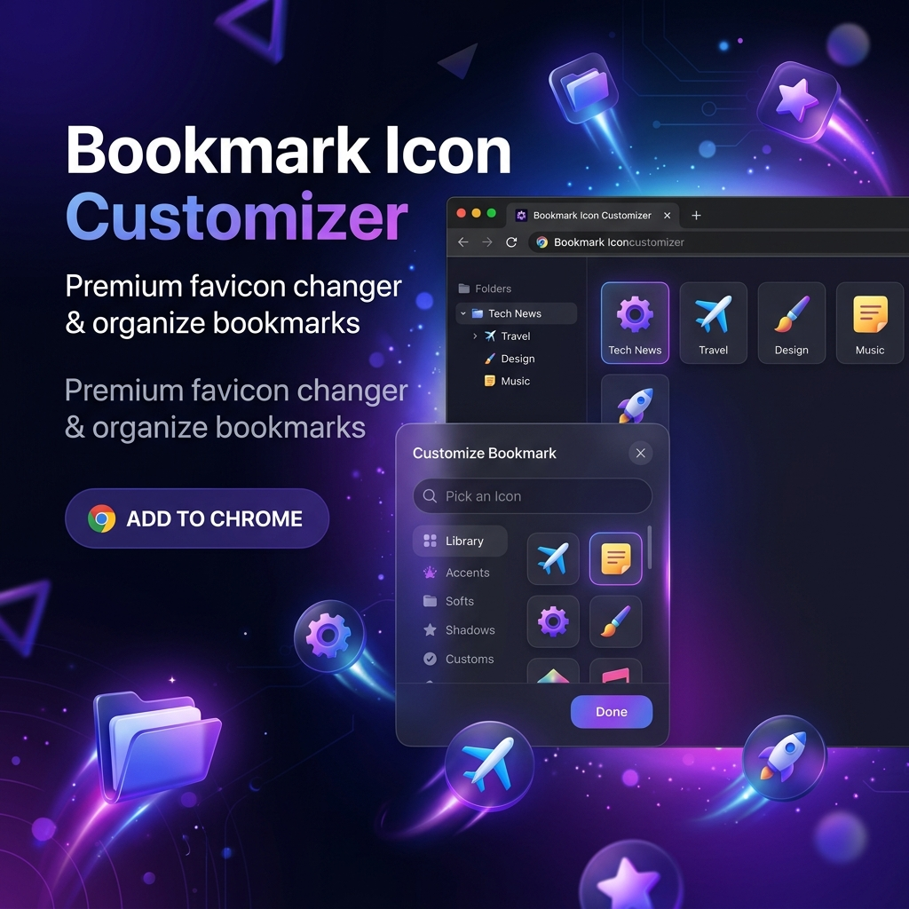

# Bookmark Icon Customizer 🔖✨

A premium Chrome extension and **favicon changer** to easily customize your bookmark icons. No more generic icons—personalize your bookmarks bar with emojis, custom images, and high-quality designs. This **bookmark changer** is designed for power users who want a beautiful and organized browsing experience.

## Features

- 📂 **Folder Navigation**: Browse your bookmarks by folder or search across your entire collection.
- 🎨 **Emoji Picker**: High-DPI (128x128) rendering of standard emojis for crisp, vibrant icons.
- 📤 **Custom Upload**: Support for PNG, JPG, and ICO file uploads.
- 🔍 **Real-time Search**: Fuzzy matching to find any bookmark in seconds.
- ⚡ **Seamless Redirects**: Uses a high-performance redirect method that preserves browser history.
- 🛡️ **Privacy First**: Minimal permissions required (`bookmarks`, `storage`, `favicon`). No background data collection.
- 🌑 **Premium Aesthetics**: Glassmorphic dark theme with smooth micro-animations.

## How it Works

Since Google Chrome does not allow extensions to directly modify the native favicon database of the browser, this extension uses a **Redirect Strategy**:
1. It creates a small internal extension page for your bookmark.
2. This page carries the custom icon you selected.
3. When you click the bookmark, the extension page loads the icon and immediately redirects to the original destination.
4. Chrome caches the icon from the extension page, displaying it in your bookmarks bar.

## Installation (Development Mode)

1. Clone or download this repository.
2. Open Chrome and navigate to `chrome://extensions/`.
3. Enable **Developer mode** (toggle in the top right).
4. Click **Load unpacked** and select the folder containing this extension.
5. Click the extension icon in your toolbar to start customizing!

## Implementation Details

- **Manifest V3**: Built using the latest Chrome extension standards.
- **Vanilla JS**: No heavy frameworks, ensuring fast load times and minimal resource usage.
- **Glassmorphism UI**: Modern styling with backdrop-blur and CSS variables for theming.

## Contributing

Contributions are welcome! Please feel free to submit a Pull Request or open an issue.

## License

This project is licensed under the MIT License - see the [LICENSE](LICENSE) file for details.
